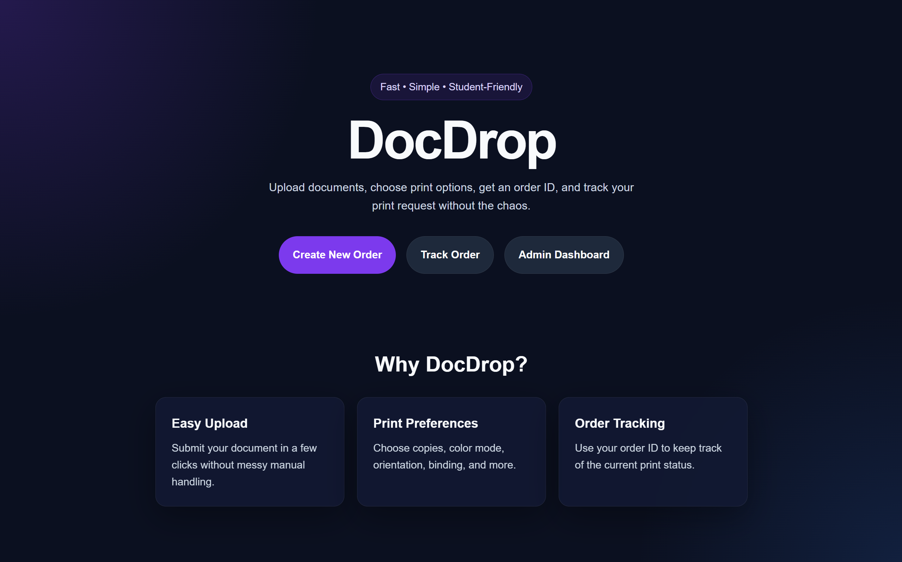
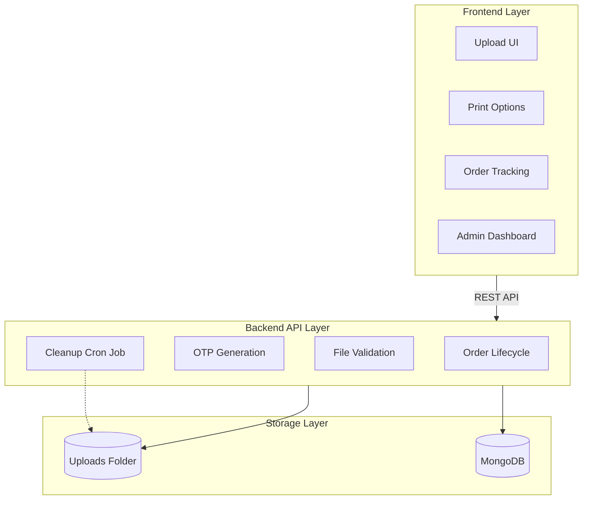

# DocDrop

<p align="center">
  
</p>

<p align="center">
  
  
  
  
  
  
</p>

<p align="center">
A secure temporary document submission and print-request management system built to learn full-stack development through a realistic workflow-driven project.
</p>

---

# Table of Contents

- Overview
- Why This Project Exists
- Problem Statement
- Core Features
- Tech Stack
- Folder Structure
- System Architecture
- Technical Problems and Solutions
- Workflow
- API Design
- API Response Examples
- Order Lifecycle
- Security Considerations
- Local Development Setup
- Environment Variables
- Learning Goals
- License

---

# Overview

DocDrop is a secure temporary document submission and print-request management system.

Users can:

- Upload a document
- Choose print options
- Receive an order ID and OTP
- Track request status

Admins can:

- Manage incoming print requests
- Update statuses
- Verify OTP during delivery
- Ensure uploaded files are deleted after completion or expiry

---

# Why This Project Exists

Printing documents sounds simple until the workflow becomes digital.

A real print-request system must answer:

- How does a user upload a document safely?
- Where is the file stored?
- How do we avoid permanent storage of private files?
- How do admins track order status?
- How do we verify delivery securely?
- How do we automatically delete expired documents?

DocDrop solves these problems through a structured full-stack architecture.

---

# Problem Statement

Most file upload demos stop at:

> “File uploaded successfully.”

But a real workflow requires much more.

A document print platform must support:

1. Secure temporary file upload
2. Print option selection
3. Metadata tracking
4. Order lifecycle management
5. OTP verification
6. Automatic cleanup of expired files
7. Admin workflow control

---

# Core Features

## User Features

- Upload documents for printing
- Select print options
  - Number of copies
  - Color / Black & White
  - Single or double-sided
- Receive unique Order ID
- Receive OTP for verification
- Track order status

## Admin Features

- View all print requests
- Filter orders by status
- View order details
- Update order status
- Verify OTP before delivery
- Delete expired or completed files

---

# Tech Stack

## Frontend

- React
- Vite
- Axios
- Tailwind CSS _(optional)_

## Backend

- Node.js
- Express.js
- Multer
- MongoDB
- Mongoose
- node-cron
- dotenv

---

# Folder Structure

```bash
docdrop/
├── frontend/
│   ├── public/
│   │   ├── favicon.ico
│   │   └── preview.png
│   ├── src/
│   │   ├── assets/
│   │   ├── components/
│   │   ├── pages/
│   │   ├── services/
│   │   ├── hooks/
│   │   ├── utils/
│   │   ├── layouts/
│   │   ├── router/
│   │   ├── styles/
│   │   ├── App.jsx
│   │   └── main.jsx
│   ├── .env
│   └── package.json
│
├── backend/
│   ├── src/
│   │   ├── config/
│   │   ├── controllers/
│   │   ├── middleware/
│   │   ├── models/
│   │   ├── routes/
│   │   ├── services/
│   │   ├── utils/
│   │   ├── jobs/
│   │   ├── uploads/
│   │   ├── app.js
│   │   └── server.js
│   ├── .env
│   └── package.json
│
├── .gitignore
└── README.md
```

## System Architecture

DocDrop follows a three-layer architecture.


